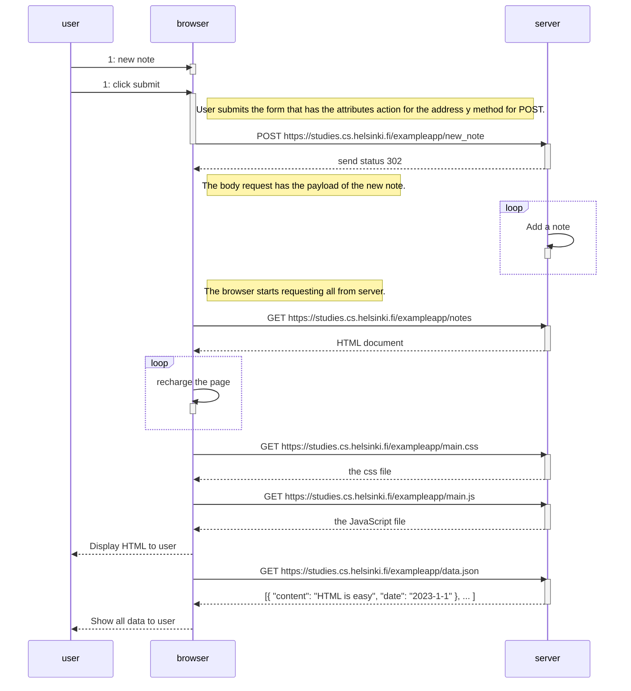

```mermaid
sequenceDiagram
    participant user
    participant browser
    participant server
    
    user->>browser: 1: new note 
    activate browser
    deactivate browser
    user->>browser: 1: click submit
    activate browser

    Note right of browser: User submits the form that has the attributes action for the address y method for POST.

    browser->>server: POST https://studies.cs.helsinki.fi/exampleapp/new_note
    deactivate browser
    activate server
    server-->>browser: send status 302
    deactivate server
    Note right of browser: The body request has the payload of the new note.

loop 
    server->>server: Add a note
    activate server
    deactivate server
end 

    Note right of browser: The browser starts requesting all from server.
    browser->>server: GET https://studies.cs.helsinki.fi/exampleapp/notes
    activate server
    server-->>browser: HTML document
    deactivate server
    loop 
    browser->>browser: recharge the page
    activate browser
    deactivate browser
end 

    browser->>server: GET https://studies.cs.helsinki.fi/exampleapp/main.css
    activate server
    server-->>browser: the css file
    deactivate server

    browser->>server: GET https://studies.cs.helsinki.fi/exampleapp/main.js
    activate server
    server-->>browser: the JavaScript file
    deactivate server

    browser-->>user: Display HTML to user

    browser->>server: GET https://studies.cs.helsinki.fi/exampleapp/data.json
    activate server
    server-->>browser: [{ "content": "HTML is easy", "date": "2023-1-1" }, ... ]
    deactivate server

    browser-->>user: Show all data to user
```