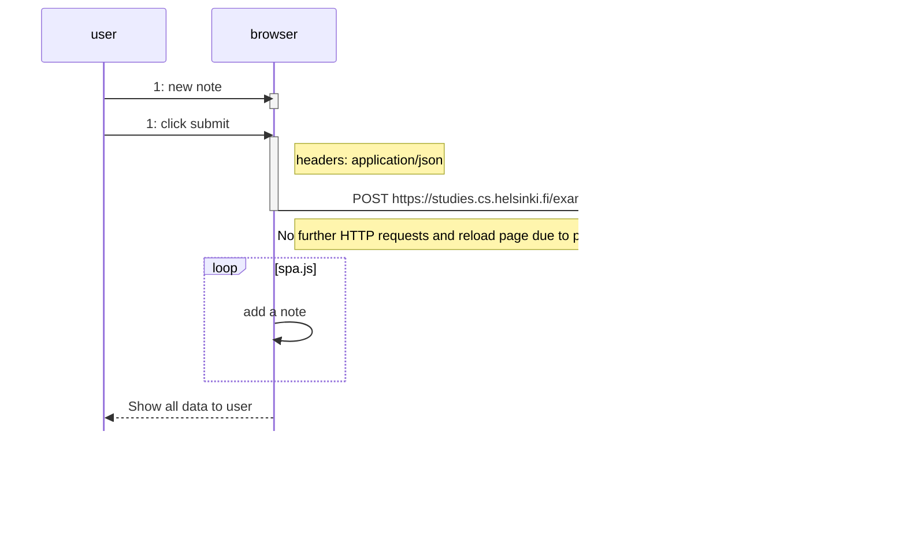

```mermaid
sequenceDiagram
    participant user
    participant browser
    participant server
    
    user->>browser: 1: new note 
    activate browser
    deactivate browser
    user->>browser: 1: click submit
    activate browser

    Note right of browser: headers: application/json 
    browser->>server: POST https://studies.cs.helsinki.fi/exampleapp/new_note_spa
    deactivate browser
    activate server
    Note right of browser: No further HTTP requests and reload page due to push new note in browser and server
    loop spa.js
    browser->>browser: add a note
    end
    browser-->>user: Show all data to user
    server-->>browser: HTML document with status 201 cretead
    deactivate server

```